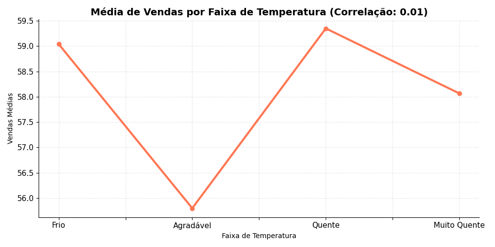
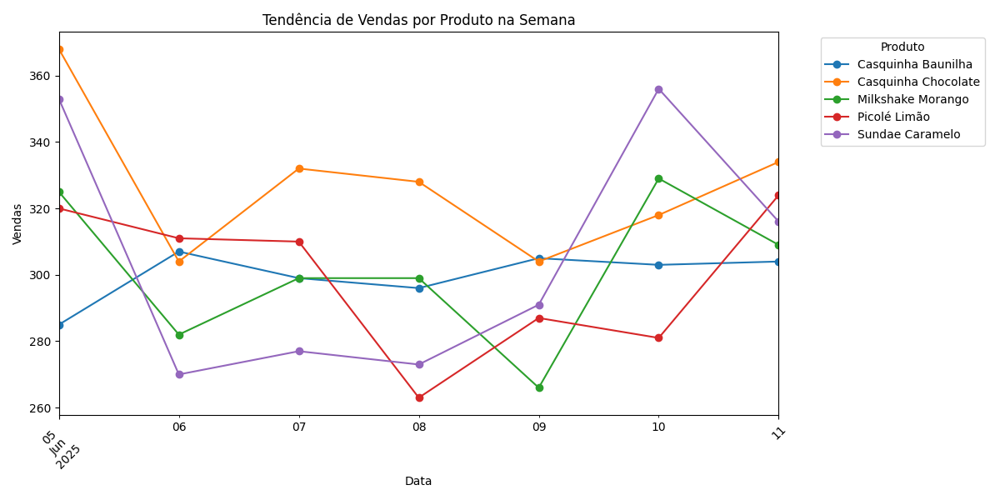

# 📊 Vendas vs Clima

Este projeto simula a relação entre **condições climáticas** e **vendas de sorvete** em três cidades fictícias ao longo de uma semana. É um exemplo prático de como dados de diferentes fontes podem ser combinados para gerar insights úteis para negócios.

## 🧠 Objetivo

Demonstrar, de forma prática, como o clima pode influenciar nas decisões de compra. Utilizamos dados simulados de temperatura e vendas para:

- Analisar o comportamento de consumo conforme a temperatura  
- Identificar produtos campeões por cidade  
- Entender a tendência semanal de vendas  

## 📁 Estrutura do Projeto

vendas-vs-clima/  
├── data/  
│   ├── Vendas_7dias.csv  
│   └── Clima_7dias.csv  
├── resultados/  
│   ├── grafico1_media_vendas_por_faixa.png  
│   ├── grafico2_percentual_vendas_por_faixa.png  
│   └── ...  
├── main.py  
├── requirements.txt  
└── README.md  

## 🛠️ Tecnologias Utilizadas

- Python 3.12  
- Pandas  
- Matplotlib  
- Seaborn  

## ▶️ Como executar

1. Clone o repositório:  
`git clone https://github.com/seu-usuario/vendas-vs-clima.git`

2. Instale as dependências:  
`pip install -r requirements.txt`

3. Execute o script principal:  
`python main.py`

Os gráficos serão gerados automaticamente na pasta `/resultados`.

## 📈 Exemplos de Gráficos Gerados

Média de Vendas por Faixa de Temperatura  

Tendência de Vendas Semanais  

## ✍️ Autor

Feito com dedicação por [Lucas Soares](https://www.linkedin.com/in/lucas-soares-ferreira/)  
Este projeto faz parte da iniciativa **Tudo Vira Dados** para democratizar o conhecimento em tecnologia e dados.
